# Chaty (Chat Website)

## Table of Contents
1. Introduction
2. Installation
3. Usage
4. Features
5. Contributing
6. License

## Introduction <a name="introduction"></a>
Chaty is a real-time, multi-language chat website that offers both one-on-one and group chat functionalities. It ensures instant message delivery and supports multiple languages, catering to a diverse user base. Whether you're having a private conversation or engaging in group discussions, Chaty provides a seamless and efficient platform for all your communication needs. Experience the world of real-time, multi-language communication with Chaty!

## Installation <a name="installation"></a>

#### Clone Repo
To get started with the project, first, you need to clone the repository. Open your terminal and run the following command:

```bash
git clone https://github.com/bassem072/chaty.git
```
#### Backend Installation
- ##### Prerequisites
  1. ###### MongoDB Installation
        - Before you can run the project, you need to have MongoDB installed on your machine. You can find the installation instructions for different platforms in the MongoDB
        - After installing MongoDB, you need to get the CONNECTION_URL for your MongoDB server. If you’re running MongoDB locally, the CONNECTION_URL is typically mongodb://localhost:270172. If you’re using MongoDB Atlas, you can find the CONNECTION_URL in the Connect dialog
  2. ###### Get Google Client ID and Client Secret
        - Read this article to know how to get google client id and client secret [Here](https://www.balbooa.com/help/gridbox-documentation/integrations/other/google-client-id).
  3. ###### Get Facebook App ID and App Secret
        - Read this article to know how to get facebook app id and app secret [Here](https://goldplugins.com/documentation/wp-social-pro-documentation/how-to-get-an-app-id-and-secret-key-from-facebook).
  4. ###### Get Google App Password
        - Create a google app password from this [link](https://myaccount.google.com/apppasswords)
- ##### Open the project in terminal
- ##### Navigate to the server directory
  ```bash
  cd server
  ```
- ##### Run this command to install all server packages
  ```bash
  npm install
  ```
- ##### Run this command to install faker package in dev dependencies
  ```bash
  npm install faker --save-dev
  ```
- ##### Create a new file with name ".env" in the server directory
- ##### Copy all environment variables from .env.example to .env file with valid values (we get it in prerequisites section)
- ##### Run this command to run server locally
  ```bash
  npm start
  ```
#### Client Server
- ##### Open the project in terminal
- ##### Navigate to the client directory
  ```bash
  cd client
  ```
- ##### Run this command to install all client packages
  ```bash
  npm install
  ```
- ### Tailwind CSS Installation

```bash
npm install -D tailwindcss@latest postcss@latest autoprefixer@latest
```

## Usage <a name="usage"></a>
#### Login


#### Register


#### Profile
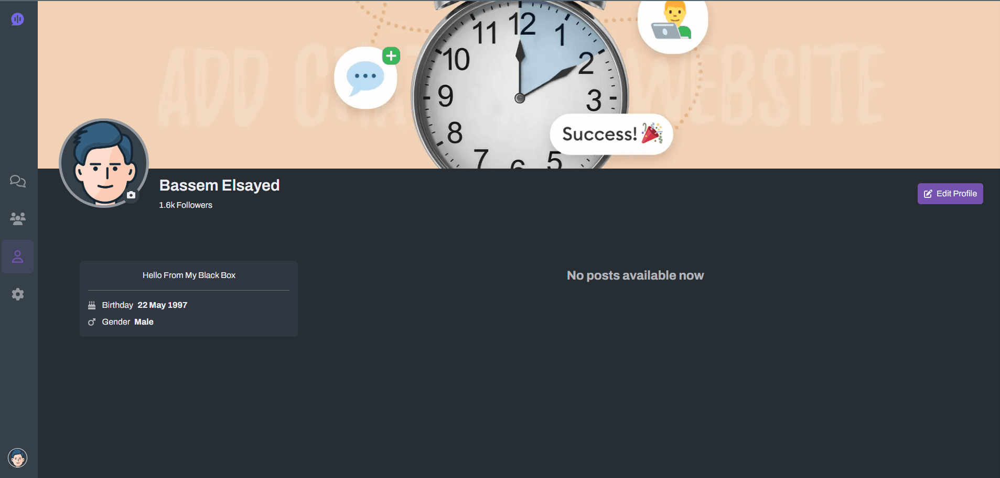

#### Edit Profile Picture


#### Search Users
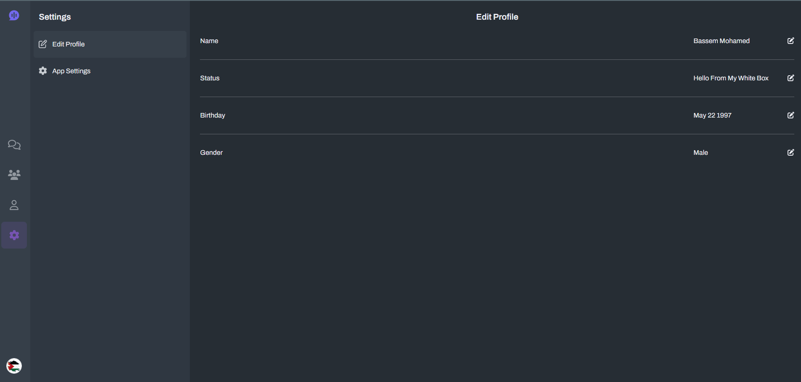

#### Message User
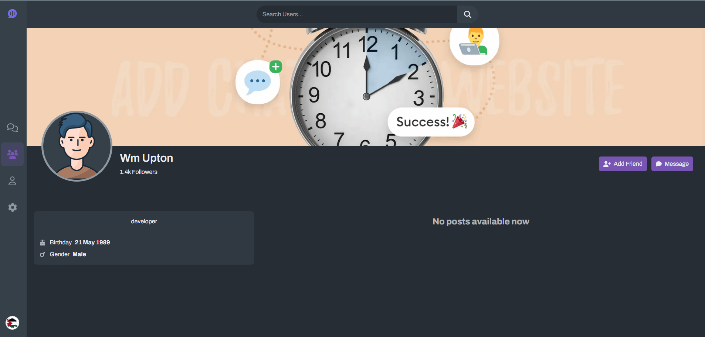

#### Chats Search And Filters
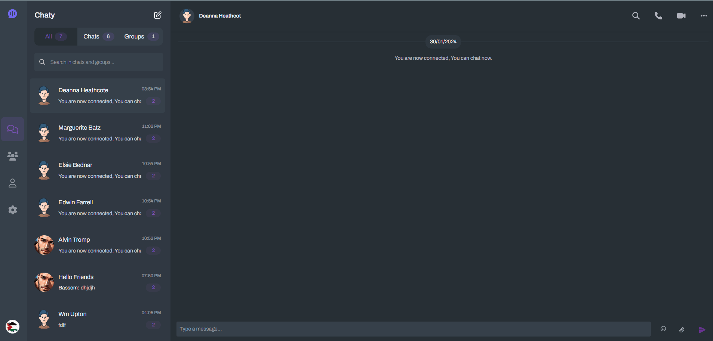

#### Online Users
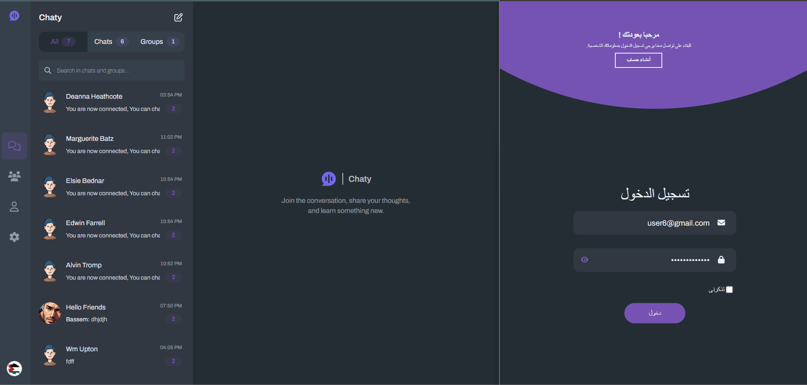

#### Typing Message
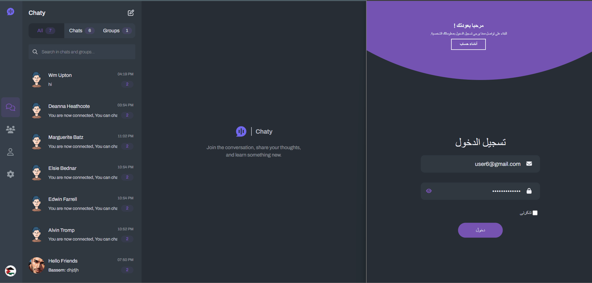

#### Send Message
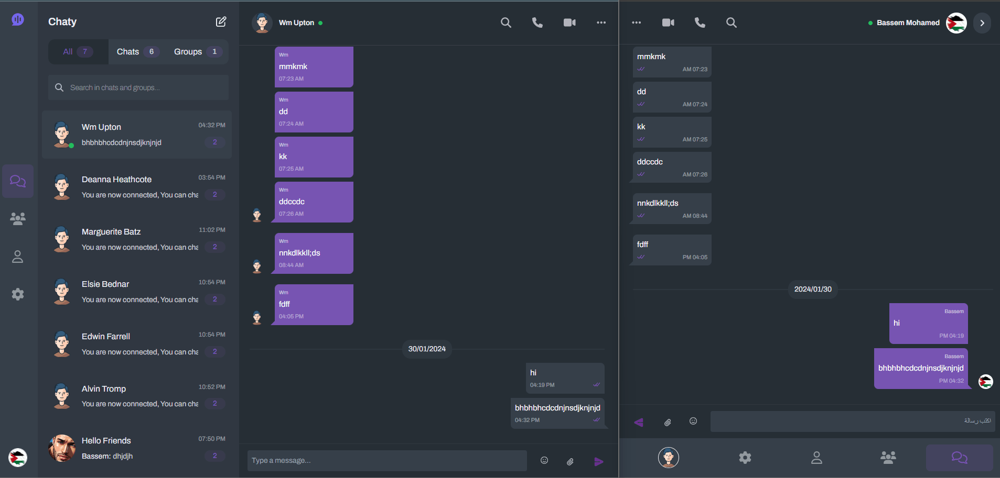

#### Emoji And Multiline Message
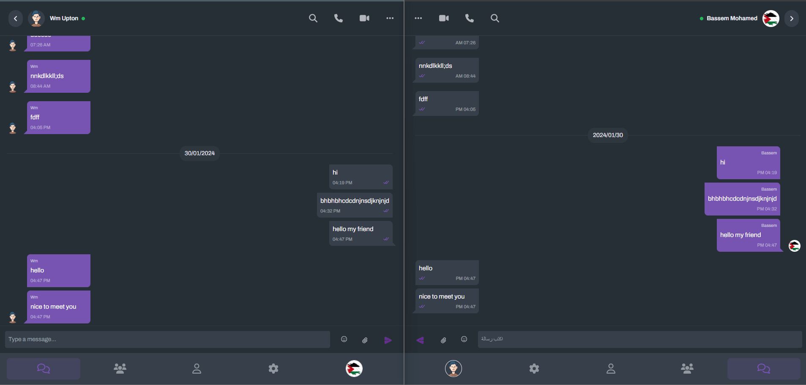

#### Create Group
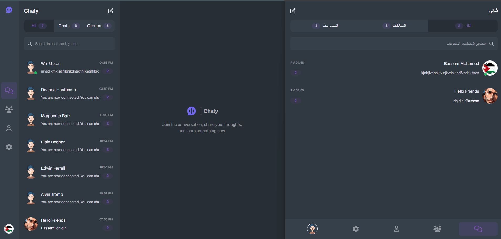

#### Add And Remove Admins In Group
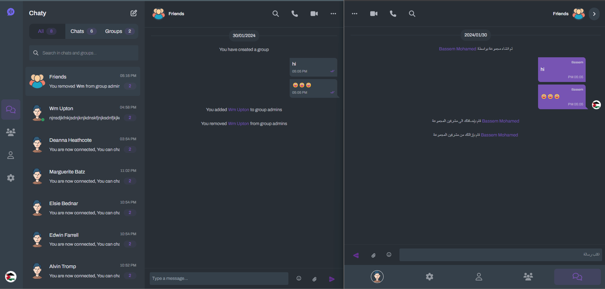

#### Add User
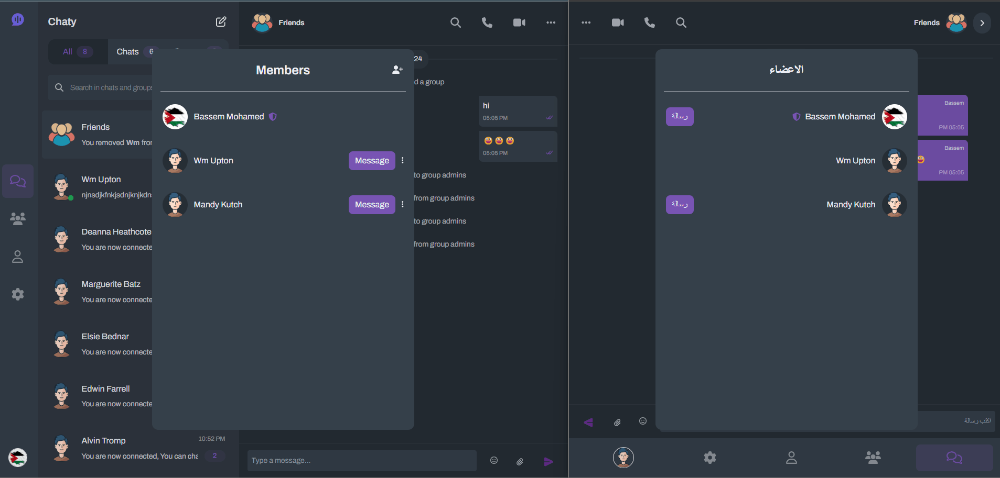

#### RTL
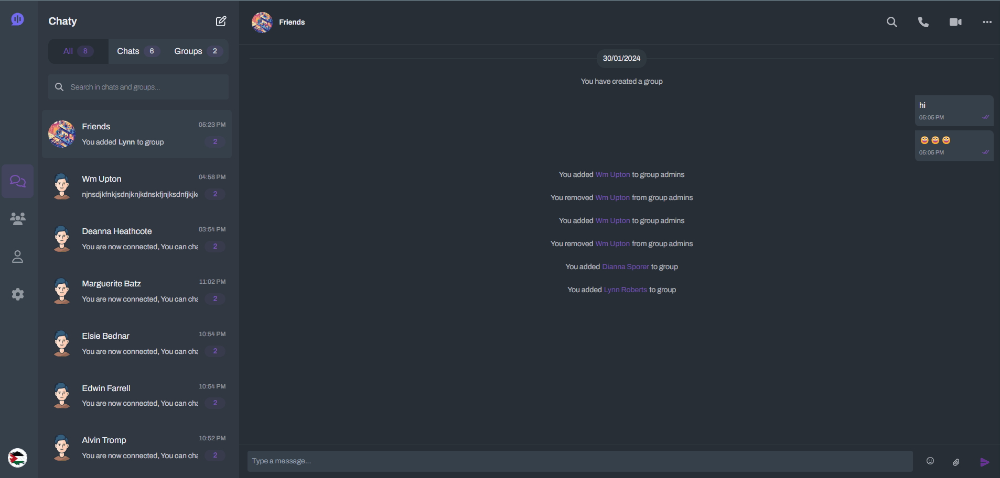

## Features <a name="features"></a>
A detailed description of all the features of the project.

## Contributing <a name="contributing"></a>
Guidelines on how to contribute to the project.

## License <a name="license"></a>
Information about the project's license.