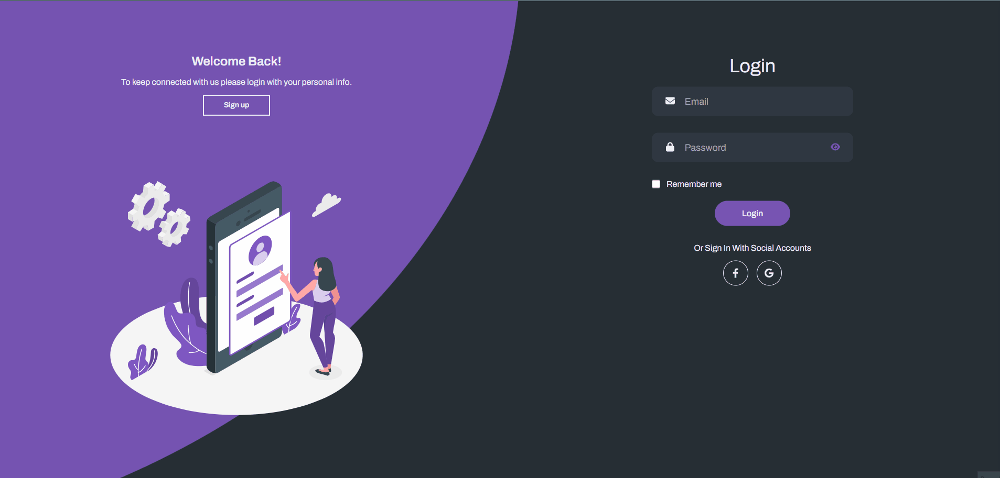
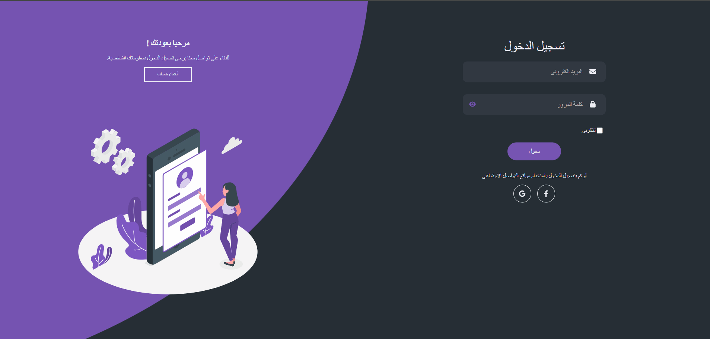

# Chaty (Chat Website)

## Table of Contents
1. [Introduction](#introduction)
2. [Features](#features)
3. [Future Features](#future-features)
4. [Technologies](#technologies)
5. [Setup](#setup)
6. [Usage](#usage)

## Introduction
Chaty is a real-time, multi-language chat website that offers both one-on-one and group chat functionalities. It ensures instant message delivery and supports multiple languages, catering to a diverse user base. Whether you're having a private conversation or engaging in group discussions, Chaty provides a seamless and efficient platform for all your communication needs. Experience the world of real-time, multi-language communication with Chaty!

## Features
##### Chaty offers a variety of features to enhance the user experience:

- **One-to-One Chat**: Users can engage in private, one-on-one conversations.
- **Group Chat Creation**: Users can create a group chat with at least two other users, facilitating communication among multiple users simultaneously.
- **Real-Time Messaging**: Messages are sent and received in real time, ensuring seamless communication.
- **LTR and RTL Support**: The website supports both Left-to-Right (LTR) and Right-to-Left (RTL) text directions, accommodating users of different languages.
- **Security**: Conversations are secure, with measures in place to protect user data and privacy.
- **Error Handling**: The website has robust error handling in both the front end and the backend, ensuring a smooth user experience.
- **User Profiles**: Users can create and customize their own profiles, adding a personal touch to their interactions.
- **Typing Indicator**: Users can see when their conversation partner is typing, making the chat more interactive.
- **Online User Indicator**: Users can see who is online, making it easier to start conversations.
- **Emoji Support**: Users can express themselves with a wide range of emojis.
- **Admin Functionalities**: Group admins have special privileges and controls to manage their groups effectively. 
- **Profile Image Change**: Users can change their profile images, allowing them to personalize their online presence.
- **Group Chat Image Change**: Group admins can change the group chat image, helping to set the tone for the group.
- **Search**: Users can search for specific chats and groups, making it easier to navigate through the application.

Each feature is designed with the user in mind, aiming to provide a smooth, engaging, and enjoyable chatting experience.

## Future Features

Chaty website plans to implement the following features to enhance the user experience:

- **Friend Requests**: Users will be able to send, accept, and remove friend requests, enhancing their social networking experience.
- **Block User**: Users will be able to block other users, improving their privacy and security.
- **Improved Profile Information**: The website will offer enhanced profile information features, allowing users to provide more details about themselves and customize their profiles to their liking.
- **Posts, Comments, and Replies**: Users will be able to make posts, comments, and replies, fostering more interactive communication.
- **Reactions**: Users will be able to react to posts, comments, and replies, making the chat more engaging.
- **Message Reactions**: Users will be able to react to messages, adding another layer of interaction in chats.
- **Image Messages**: Users will be able to send image messages, enriching the ways they can communicate.
- **Voice Note Messages**: Users will be able to send voice note messages, providing a more personal and expressive way of communication.
- **Message Reply**: Users will be able to reply to specific messages, making conversations more contextual and organized.
- **Voice Call**: Users will be able to make voice calls, providing a more personal and immediate way of communication.
- **Video Call**: Users will be able to make video calls, enhancing the ways users can communicate and interact.
- **Join and Leave Group Chat**: Users will be able to join and leave group chats as they wish, giving them more control over their group chat memberships.
- **Improved Group Chat Controls**: Group chat controls will be improved, providing admins with more options to manage their groups effectively.
- **Group Chat Media Section**: A media section will be added to group chats, allowing users to share and view media files within the group.
- **Notification System**: A notification system will be implemented to keep users updated on new messages, friend requests, and more.
- **Improved Search System**: The search system will be improved to make finding chats, groups, and users easier and more efficient.
- **Groups and Pages**: Users will be able to create and manage groups and pages, providing a platform for larger communities.
- **Full Control for Group and Page Admins**: Admins will have full control over their groups and pages, including settings, memberships, and content.
- **Video Support**: The website will support video messages, enhancing the ways users can communicate.
- **Improved Website Design**: The website design will be improved to provide a more user-friendly and aesthetically pleasing interface.

## Technologies
- #### Database
  ###### MongoDB: You can setup it from [here](https://www.mongodb.com/try/download/community)

- #### Package Manager
  **NPM**: A package manager for JavaScript, used to manage project dependencies.

- #### Backend
  - Language: ***javaScript***
  - Language Runtime: ***node.js***
  - Framework: ***Express.js***
  - Realtime Technologies: ***Socket IO***
  - Used Packages:
      1. ###### bcrypt: "^5.1.1",
      2. ###### body-parser: "^1.20.2",
      3. ###### cookie-parser: "^1.4.6",
      4. ###### cookie-session: "^2.1.0",
      5. ###### cors: "^2.8.5",
      6. ###### dotenv: "^16.3.1",
      7. ###### express: "^4.18.2",
      8. ###### express-async-handler: "^1.2.0",
      9. ###### express-rate-limit: "^7.1.3",
      10. ###### express-rate-limiter: "^1.3.1",
      11. ###### express-validator: "^7.0.1",
      12. ###### jsonwebtoken: "^9.0.2",
      13. ###### mongoose: "^7.6.3",
      14. ###### morgan: "^1.10.0",
      15. ###### multer: "^1.4.5-lts.1",
      16. ###### nodemailer: "^6.9.7",
      17. ###### passport: "^0.6.0",
      18. ######  passport-facebook: "^3.0.0",
      19. ###### passport-google-oauth20: "^2.0.0",
      20. ###### sharp: "^0.32.6",
      21. ###### slugify: "^1.6.6",
      22. ###### socket.io: "^4.7.3",
      23. ###### uuid: "^9.0.1"
- #### Frontend
  - Language: ***javaScript***
  - Framework: ***React.js***
  - Localization Package: ***i18next***
  - Realtime Technologies: ***Socket IO Client***
  - Used Packages:
    1. ###### @fortawesome/fontawesome-svg-core: "^6.4.2",
    2. ###### @fortawesome/free-brands-svg-icons: "^6.4.2",
    3. ###### @fortawesome/free-regular-svg-icons: "^6.5.1",
    4. ###### @fortawesome/free-solid-svg-icons": "^6.4.2",
    5. ###### @fortawesome/react-fontawesome: "^0.2.0",
    6. ###### @reduxjs/toolkit: "^1.9.7",
    7. ###### @testing-library/jest-dom: "^5.17.0",
    8. ###### @testing-library/react: "^13.4.0",
    9. ###### @testing-library/user-event: "^13.5.0",
    10. ###### axios": "^1.6.2",
    11. ###### emoji-picker-react: "^4.6.5",
    12. ###### formik: "^2.4.5",
    13. ###### history: "^5.3.0",
    14. ###### i18next: "^23.7.8",
    15. ###### i18next-browser-languagedetector: "^7.2.0",
    16. ###### i18next-http-backend: "^2.4.2",
    17. ###### moment: "^2.29.4",
    18. ###### moment-timezone: "^0.5.43",
    19. ###### react: "^18.2.0",
    20. ###### react-avatar-editor: "^13.0.2",
    21. ###### react-cookie: "^6.1.1",
    22. ###### react-datepicker: "^4.25.0",
    23. ###### react-dom: "^18.2.0",
    24. ###### react-dropzone: "^14.2.3",
    25. ###### react-helmet: "^6.1.0",
    26. ###### react-i18next: "^13.5.0",
    27. ###### react-redux: "^8.1.3",
    28. ###### react-router-dom: "^6.18.0",
    29. ###### react-scripts: "5.0.1",
    30. ###### react-toastify: "^9.1.3",
    31. ###### socket.io-client: "^4.7.3",
    32. ###### web-vitals: "^2.1.4"


## Setup

#### Clone Repo
To get started with the project, first, you need to clone the repository. Open your terminal and run the following command:

```bash
git clone https://github.com/bassem072/chaty.git
```
#### Backend Installation
- ##### Prerequisites
  1. ###### MongoDB Installation
        - Before you can run the project, you need to have MongoDB installed on your machine. You can find the installation instructions for different platforms in the MongoDB
        - After installing MongoDB, you need to get the CONNECTION_URL for your MongoDB server. If you’re running MongoDB locally, the CONNECTION_URL is typically mongodb://localhost:270172. If you’re using MongoDB Atlas, you can find the CONNECTION_URL in the Connect dialog
  2. ###### Get Google Client ID and Client Secret
        - Read this article to know how to get google client id and client secret [Here](https://www.balbooa.com/help/gridbox-documentation/integrations/other/google-client-id).
  3. ###### Get Facebook App ID and App Secret
        - Read this article to know how to get facebook app id and app secret [Here](https://goldplugins.com/documentation/wp-social-pro-documentation/how-to-get-an-app-id-and-secret-key-from-facebook).
  4. ###### Get Google App Password
        - Create a google app password from this [link](https://myaccount.google.com/apppasswords)
- ##### Open the project in terminal
- ##### Navigate to the server directory
  ```bash
  cd server
  ```
- ##### Run this command to install all server packages
  ```bash
  npm install
  ```
- ##### Run this command to install faker package in dev dependencies
  ```bash
  npm install faker --save-dev
  ```
- ##### Create a new file with name ".env" in the server directory
- ##### Copy all environment variables from .env.example to .env file with valid values (we get it in prerequisites section)
- ##### Run this command to run server locally
  ```bash
  npm start
  ```
#### Client Server
- ##### Open the project in terminal
- ##### Navigate to the client directory
  ```bash
  cd client
  ```
- ##### Run this command to install all client packages
  ```bash
  npm install
  ```
- ### Tailwind CSS Installation

  ```bash
  npm install -D tailwindcss@latest postcss@latest autoprefixer@latest
  ```

## Usage
#### Login


#### Register


#### Email Verification


#### Profile


#### Edit Profile Picture


#### Search Users


#### Message User


#### Chats Search And Filters


#### Online Users


#### Typing Message


#### Send Message


#### Emoji And Multiline Message


#### Create Group


#### Change Group Image


#### Add And Remove Admins In Group


#### Add User


#### RTL


#### Responsive

